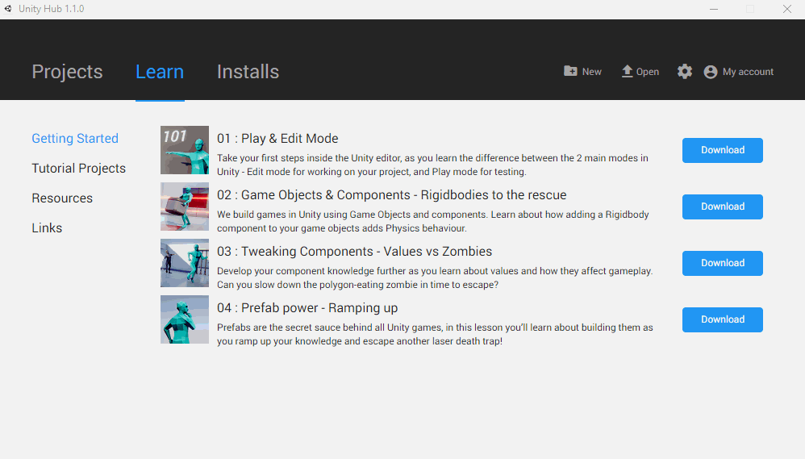
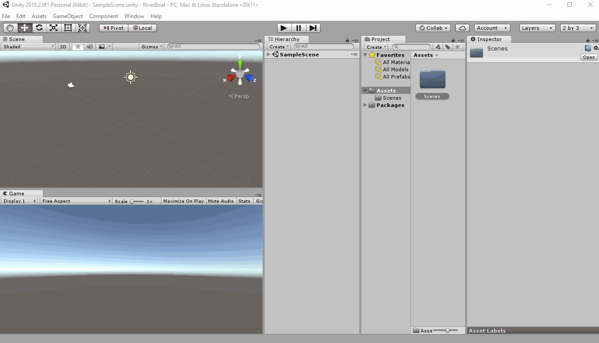

# Creating our Project

The first step is to create our project.

If you don't have Unity installed - refer to these instruction : [Installing Unity](https:www.unity.com)

Open Unity (or UnityHub) and create a new Project.

Once the project loads - it should look like this this:  

You can rearrenge the windows to however you prefer.  
I like to arrange them in the following format:

- Scene and Game panels side by side
- Console panel under both Scene and Game Panels
- Hierarchy Panel above the Project Panel
- Inspector Panel on the side
  
Feel free to arrange the panels to however it works best for you.

[<< Previous Lesson](introduction.md) | [Next Lesson >>](lesson.2.md)
