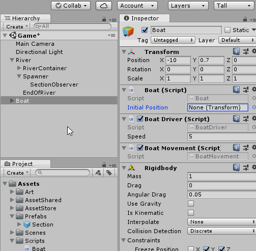
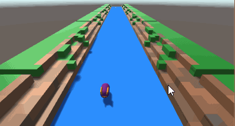

# Do something when hitting the sides (10 mins)

## Let's Code - Reset Boat
Create a new script called **Boat**
(move it to the scripts folder to keep things organized)
> In the script **Boat** add the variable
> - public variable, named *initialPosition* of type **Transform**  
> 
> In the script **Boat** add a new method called "Reset"
> - Takes no arguments
> - Returns **void**
> - It method is **public**  
> 
> In the method "Reset" in the **Boat** script
> - Set the transform position to the initialPosition's position  
> 
> In the script **Boat** add a new method called "OnCollisionEnter"
> - Takes one argument, named *other* of type **Collision**
> - Returns **void**
> - The method is **private**  
> 
> In the method "OnCollisionEnter" in the **Boat** script
> - call the function "Reset"
> - add a Debug.Log line that prints the other **GameObject**

Code Example : [Link](resources/code-example/Boat_example.1.cs)

## Go back to Unity and hook up GameObjects to our script
Create BoatStartPosition GameObject
 - Create new Empty Object
 - Name it BoatStartPosition
 - At the inspector, set initialPosition on Boat to BoatStartPosition
 - Set BoatStartPosition Transform Position to be the same as the Boat

When we play our game, we will see that when we hit the sides, the boat is put back at the start position!

---
[<< Previous Lesson](lesson.9.md) | [Next Lesson >>](lesson.11.md)
