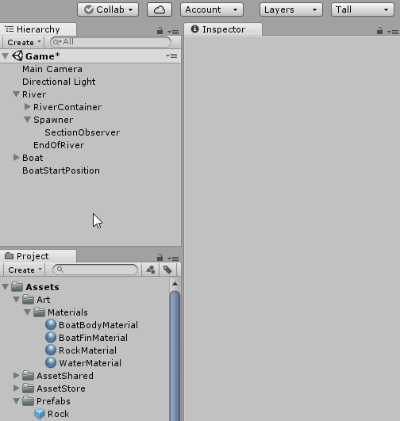

# Obstacles!
We need to add some difficulty to our game.  
We will do that by adding two types of obstacles.  
One that makes you lose (rocks) and another that gives you points (trash)!  

We will start by spawning rocks!

## Let's Code - Obstacle Spawner Script

Create a new script called "ObstacleSpawner"
> In the "ObstacleSpawner" script add the variables
> - public variable, named *river* of type **River**
> - public variable, named *spawnPrefab* of type **GameObject**
> - public variable, named *spawnFrequency* of type **float**
> - public variable, named *spawnPositionContainer* of type **Transform**
> - private variable, named *spawnTimer* of type **float**
> 
> In the "ObstacleScript" add a new method called "Spawn"
> - Takes one argument, named *position* of type **Vector3**
> - Returns **void**
> - The method is **private**
>  
> In the method "Spawn" in the "ObstacleSpawner" script
> - Instantiate a new GameObject with the arguments spawnPrefab, position and Quaternion.identity
> - store the returned value in a variable called spawned of type GameObject
> - call the method Add from the variable river and pass the "spawned" variable
> 
> In the method "Update" in the "ObstacleSpawner" script
> - decrease the variable spawnTimer with the value Time.deltaTime
> - if the variable spawnTimer is less than equal to zero
>   - set spawnTimer equal spawnFrequency
>   - retrieve a random child of spawnPositionContainer
>   - save the child's position to a variable called position
>   - call the method "Spawn" and pass the variable position

Code Example : [Link](resources/code-example/ObstacleSpawner_example.1.cs)

// todo - everythin below here

#let's Create GameObjects to Hook up to our script

## Creating a Rock Prefab
Create a new Cube 3D Object
 - Name it Rock
 - Add a Rigidbody
    - Set UseGravity to false
    - Freeze Positions: X, Y
    - Freeze Rotations: Z, Y, Z

Create RockMaterial
 - On the Project Panel, on the Material's folder (Art/Material)
 - Right Click > Create > Material
 - Name it RockMaterial
 - Give it a color
 - Assign it to the Rock GameObject

Make Rock a prefab
 - Drag Rock GameObject to Project panel
 - Put it under Prefabs (for organization purposes)
 - Delete Rock GameObject from Hierarchy Panel

## Creating a Trash Prefab
 - Do the same steps as for the Rock, but now create a Trash

## Create Rock Spawn Points
Create new Empty GameObject under Spawner
 - Reset Transform
 - Name it RockSpawnPoints

Create Spawn Points
 - On the RockSpawnPoints
 - Right Click > Create 3D Object > Cube
 - Remove Collider (Box Collider)
 - Name it StartPosition
 - Position it at the top of the river
 - Duplicate object and position them on the river

## Create Trash Spawn Points
 - Do the same step as the Rock Spawn Points, but for the trash

## Add ObstacleSpawner scripts
On the Spawner GameObject add the ObstacleSpawner script twice
 - One for the Rocks 
 - One for the Trash

Assign the values to the scripts. It should look like this:

## Handle Collisions with Rock and Trash

We need to know when we are colliding with either a rock or a trash GameObject.
There are many ways we could do that.
We are going to tag our obstacles with some values that will allow us to know which type of obstacle we are hitting.

Create new Tag Layers for Rock and Trash and assign it to Rock and Trash

## Let's Code - Handle Rock Collision
On the Boat script
> Add a variable to keep track of how long the boat has been alive
> - public variable, named "timeAlive" of type **float**
> On the OnCollisionEnter method
> - Check if the object we are colliding is tagged as Rock
> - if it is, Destroy rock and call the Reset method
> Create new method called "Update"
> - Takes no arguments
> - Returns **void**
> - The method is private
> On the method "Update"
> - increment the variable timeAlive with Time.deltaTime
> On the method "Reset"
> - set the variable "timeAlive" to the value 0

Code Example : [Link](resources/code-example/Boat_example.2.cs)

## Let's Code - Handle Trash Collision
On the Boat script
> Add a variable to keep track how much trash we have collected
> - public variable, named "trashCollected" of type **int**
> On the OnCollisionEnter method
> - Check if the object we are colliding is tagged as Trash
> - if it is, Destroy rock and increment trash collected by one
> On the method "Reset"
> - set the variable "trashCollected" to the value 0

Code Example : [Link](resources/code-example/Boat_example.2.cs)

If we play our game and select our Boat in the Inspector
We will see the variables "timeAlive" and "trashCollected" changing

We might also see an error on the Console:

That is because we are deleting the Trash and Obstacles which are added to the river. In our River script, we are going through the objects in the river to see if they are at the end of our river.
So let us change how our scripts work to fix this error - in programming we call this a bug (very cool story behind it!).

## Let's Code - Fixing a Bug
On our River script
> Add a new method called Remove
> - Takes one argument, named "obj" of type **GameObject**
> - Returns **void**
> - This method is public
> In the method Remove
> - the the obj's transform position to be the same as endOfRiverObserver's position 

Code Example : [Link](resources/code-example/River_example.9.cs)

On our Boat script
> Add a new variable
> - public variable, named "river" of type **River**
> Remove Obstacle from river
> - Replace the Destroy lines for our Obstacles with calling the Remove method in river

Code Example : [Link](resources/code-example/Boat_example.4.cs)

On Unity, when we select our Boat GameObject we will see a new variable showing.
That is the reference to our River.
Set that variable with our River GameObject
It should look like this:

[<< Previous Lesson](lesson.10.md) | [Next Lesson >>](lesson.12.md)