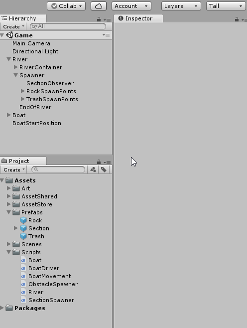

# Show Score on the Screen (5 min)
We have a game!

Let's just a one more thing to make it easier to see our score!
We already created a simple HUD to help us show the score.

In the Project Panel
Go to AssetShared > SinglePlayer_HighScore
Drag the prefab, Canvas to our Hierarchy Panel
Make sure to Drag it to an empty area

Open the SinglePlayer_GameScore script, and uncomment the commented section

This is how it looks with the commented out block  
Code Example : [Link](resources/code-example/SinglePlayer_GameScore_example.1.cs)

This is how it looks after we uncomment the block  
Code Example : [Link](resources/code-example/SinglePlayer_GameScore_example.2.cs)

Cool! We can play our game now!

Look at how much you have learned!  
Congratulations!

[<< Previous Lesson](lesson.11.md) | [Machine Learning Lessons](../machine-learning/introduction.md) | [Bonus Lesson >>](lesson.13.md)
