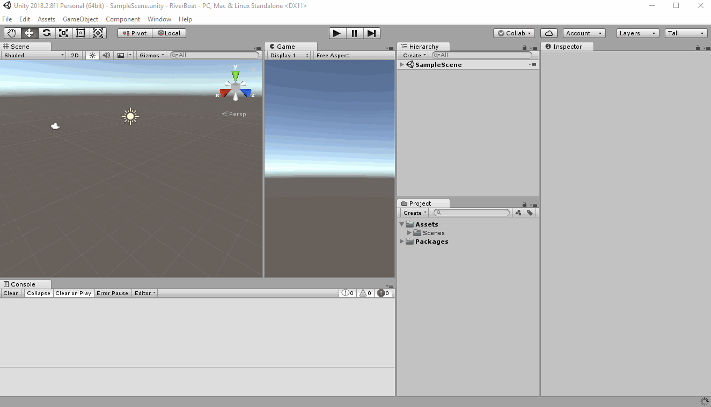

# Importing Lesson Assets
Before we start building our game, Let't import some assets that we prepared for the lesson.

Download the package from here [Lesson Package](https://github.com/gokictech/UnityML/blob/master/lessons/game/resources/unity-packages/river-boat-lesson-assets.unitypackage)

Once downloaded, go to your Unity project and import the package

 - Right Click the Assets Folder > Import Package > Custom Package... 
 - Select **river-boat-lesson-assets.unitypackage** from the downloaded location
 - Click Open
 - Once the package is Decompressed, click on Import

You should see two new folder under Assets (AssetShared and AssetStore)  
These are just some files that will help us make our game prettier 

[<< Previous Lesson](lesson.1.md) | [Next Lesson >>](lesson.3.md)