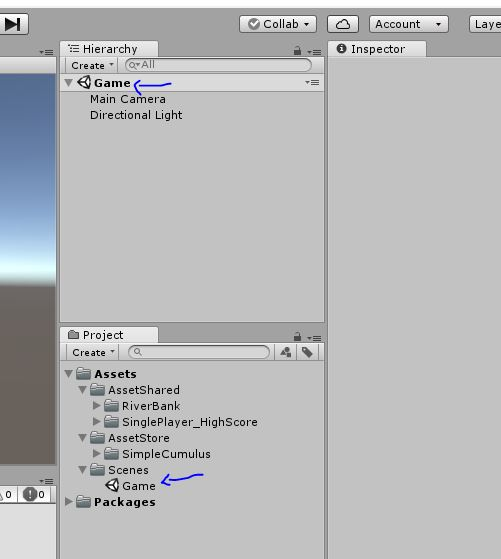

# Create the Environemnt
## Create a new Scene
 - Put it under the Scenes folder
 - Name the new scene "Game"
 - Open the Game scene
 - Delete the SampleScene
  

## Add River Banks
Drag RiverBank objects to Scene
 - Assets > AssetShared > RiverBank > RiverBank_left
 - Assets > AssetShared > RiverBank > RiverBank_right

Change the River Bank Transform Settings:
 - Left RiverBank
    - Position : 0, 0, 0
- Right River Bank
    - Position : -20, 0 ,0

It should look like this:  

[<< Previous Lesson](lesson.2.md) | [Next Lesson >>](lesson.4.md)