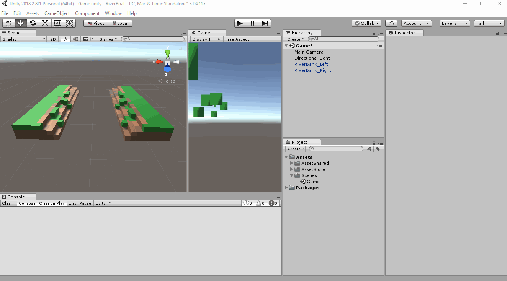

# Create the Environment
## Add River Water
Create new Cube on Game Scene
 - Right click (empty area on) Hierarchy Panel > 3D Object > Cube
 - Name it "Water"
 - Reset the Transform  
  

Make the Water game object cover the gap between the river banks  
Change the Transform settings to:
 - Position: -10, -0.5, 0
 - Scale: 15, 1, 31

## Let's add some color to this water  

First, we will create a place to save our Materials  
*(This is just so we can keep things organized)*
 - Create a Folder under Assets called "Art"
 - Create a Folder under Assets/Art called "Materials"  

Now, we will create the Material for our River Water  
*(Materials are like the "paint" that we add to our 3D objects)*
 - Right click the Materials folder > Create > Material
 - Name it "WaterMaterial"

Change the WaterMaterial settings to a water like color  
Here are the settings we used:  
 - Source: Albedo  
 - Smoothness: 0  
 - Albedo color: 0066D1  

This is how we change those settings:  

## Add the WaterMaterial to our Water GameObject
You can drag the material to the Inspector or directly to the object on the game scene.  
I like draging it to the Inspector:
 - Select the Water GameObject (on the Hierarchy Panel)
 - Drag the WaterMaterial (Project Panel) to the MeshRenderer Material (Inspector Panel)

This is how it should look like now:  

Make sure to save your scene frequently.
Simply press Control + S to save the scene.

To tell if your scene has any unsaved changes  
Look at the asterisk ("*") next to the scene name in the Hierarchy Panel

 - No changes:  

 - With changes not saved:  

---
[<< Previous Lesson](lesson.3.md) | [Next Lesson >>](lesson.5.md)