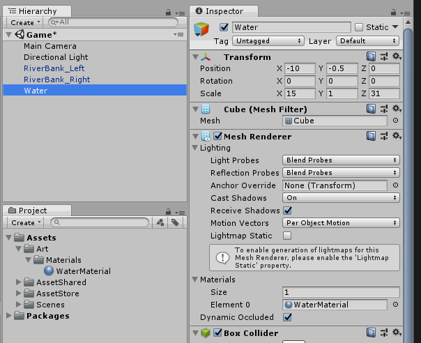
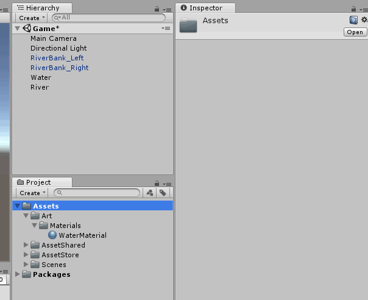
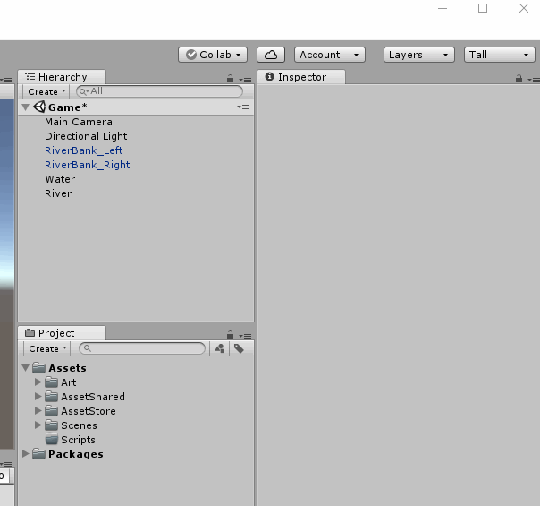
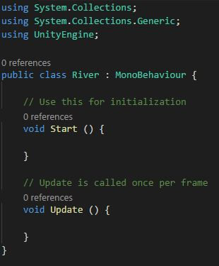
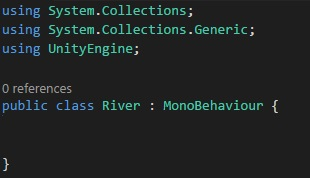

# Making our river move!
## Create new Empty GameObject 
 - On the Hierarchy Panel
 - Right Click (empty area) > Create Empty
 - Name it "River"
 - Reset the Transform

## Creating our first script!
First, let's create a folder to store our scripts.  
*(it is usually good to keep things organized)*
 - On the Project Panel
 - Right Click the Assets Folder > Create > Folder
 - Name the folder "Scripts"

Create a script called "River"  
 - On our Scripts folder
 - Right click > Create > C# Script
 - Type "River"
 - Press Enter

## Let's write some code!
First I will describe to you what we need and then I will show you the code.  

> In the future lessons,  
> Try to read what we need and write the code yourself  
> and then look at the code to compare your code to the example code.  
> For now, you can read the instructions and then look at the example code directly.

**River.cs Description**  
We will need to add 3 public variables to the River script
1. **container** of type **Transform**
2. **riverSpeed** of tpye **Vector3**
3. **addVelocityOnStart** of type **bool**

We will also need 3 methods
1. "SetVelocity"
   - Takes one argument (rb) of type **Rigidbody**
   - The method returns **void**
2. "AddObject"
   - Takes one argument (obj) of type **GameObject**
   - The method returns **void**

Now here is the example code for you to look at:  
Code Example : [Link](resources/code-example/River_example.1.cs)

Let's open our River script.  
 - Double click the River script in the Projects Panel  
 - It should open a a text editor where you can type 

> Unity automatically creates two methods for us that we won't need right now.  
> Let's go ahead and delete these two methods.
> 1. "Start"
> 2. "Update"  
> 
> With the methods  
>   
> Without the methods  
> 

Now write some code to make your River script look like the example.

## Let's Code - SetVelocity

We will write some code in the SetVelocity method.  
In more technical words, we will "*implement the SetVelocity method*"
*(again, I will describe it and then show the example code)*

> In the **SetVelocity** method on the **River** script
>    - Set the velocity of the received argument "rb" to the River script variable "*riverSpeed*"  

Code Example : [Link](resources/code-example/River_example.2.cs)

## Let's Code - Add
*(again, I will describe the implementation and then show the example code)*

> In **Add** method on the **River** script
> - Set the parent of the received argument "obj" to the River script variable "*container*"
>  - Retrieve the **Rigidbody** component from the received argument "*obj*" and save it to a *new variable* of type **Rigidbody** called "*objRb*"
>  - Call the SetVelocity method and pass "*objRb*" to it

Code Example : [Link](resources/code-example/River_example.3.cs)

[<< Previous Lesson](lesson.4.md) | [Next Lesson >>](lesson.6.md)