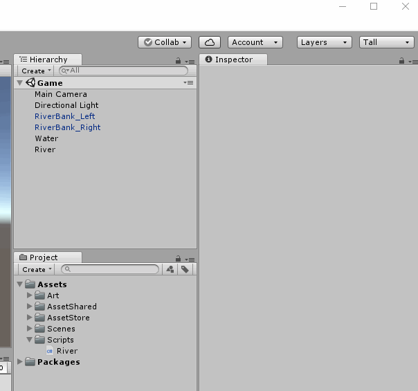
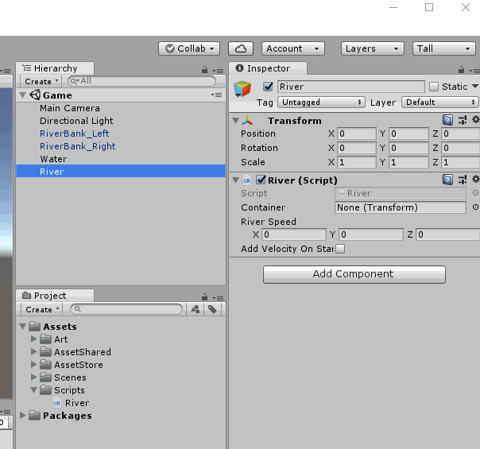
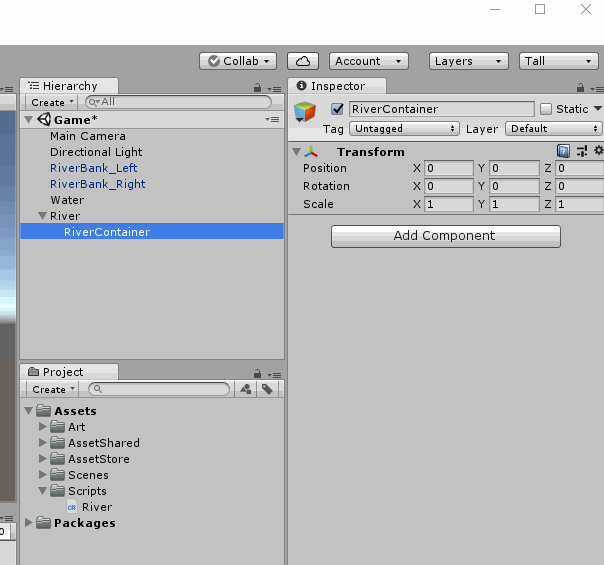
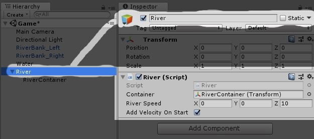
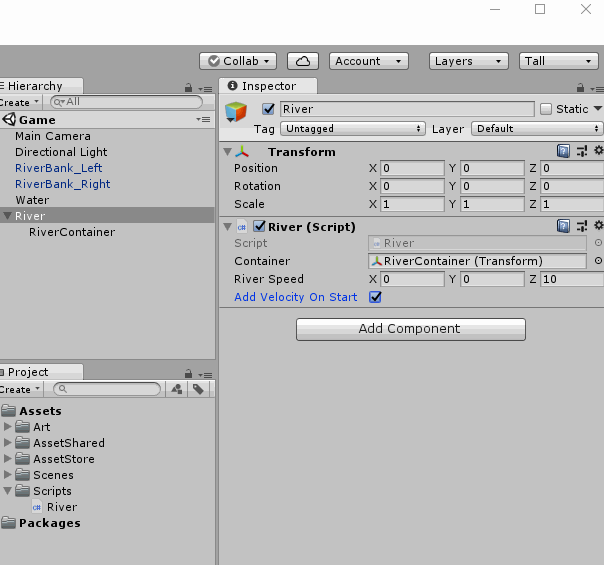
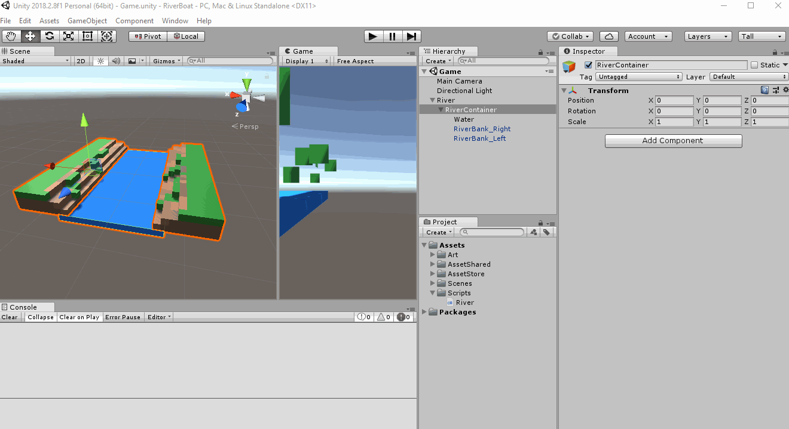
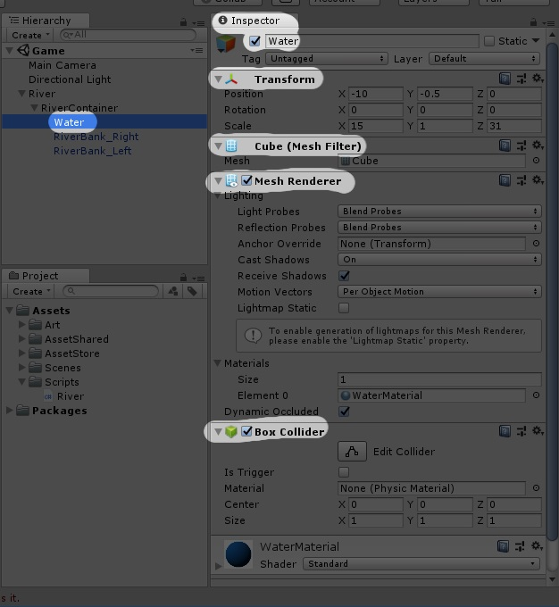
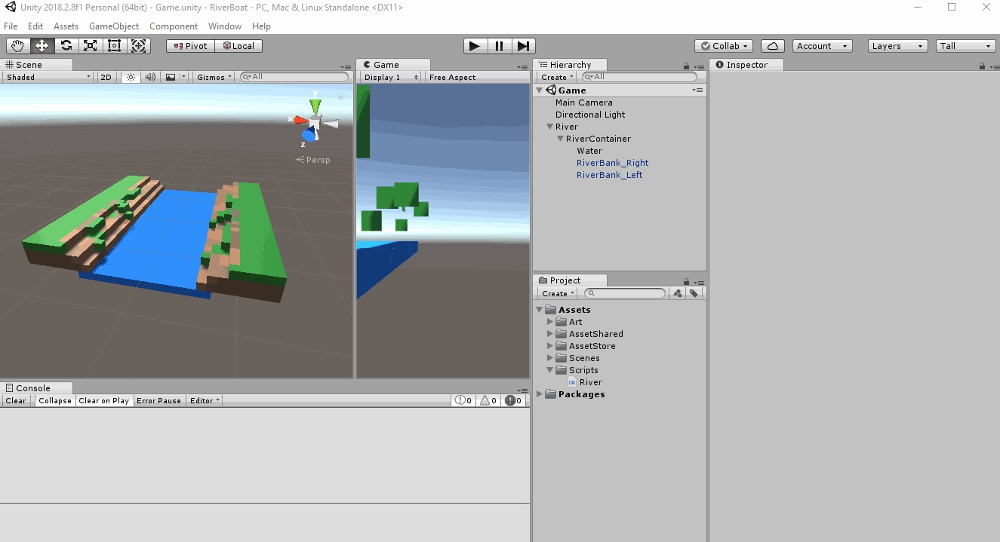
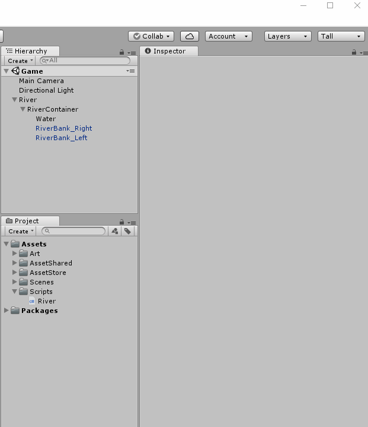
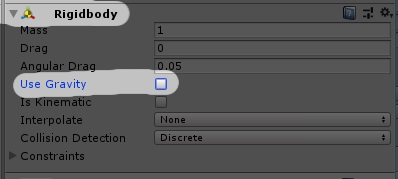

# Making our river move!
## Create new Empty GameObject 
 - On the Hierarchy Panel
 - Right Click (empty area) > Create Empty
 - Name it "River"
 - Reset the Transform

## Creating our first script!
First, let's create a folder to store our scripts.  
*(it is usually good to keep things organized)*
 - On the Project Panel
 - Right Click the Assets Folder > Create > Folder
 - Name the folder "Scripts"

Create a script called "River"  
 - On our Scripts folder
 - Right click > Create > C# Script
 - Type "River"
 - Press Enter

## Let's write some code!
First I will describe to you what we need and then I will show you the code.  

In the future lessons,  
Try to read what we need and write the code yourself  
and then look at the code to compare your code to the example code.  
For now, you can read the instructions and then look at the example code directly.

Instructions:  
> We will need to add 3 public variables to the River script
> 1. **container** of type **Transform**
> 2. **riverSpeed** of tpye **Vector3**
> 3. **addVelocityOnStart** of type **bool**
> 
> We will also need 3 methods
> 1. "SetVelocity"
>    - Takes one argument (rb) of type **Rigidbody**
>    - The method returns **void**
>    - The method is **private**
> 2. "AddObject"
>    - Takes one argument (obj) of type **GameObject**
>    - The method returns **void**
>    - The method is **public**

Now here is the example code for you to look at:  
Code Example : [Link](resources/code-example/River_example.1.cs)

Let's open our River script.  
 - Double click the River script in the Projects Panel  
 - It should open a a text editor where you can type 

> Unity automatically creates two methods for us that we won't need right now.  
> Let's go ahead and delete these two methods.
> 1. "Start"
> 2. "Update"  
> 
> With the methods  
>   
> Without the methods  
> 

Now write some code to make your River script look like the example.

## Let's Code - Implement "SetVelocity" Method

We will write some code in the SetVelocity method.  
In more technical words, we will "*implement the SetVelocity method*"
*(again, I will describe it and then show the example code)*

> In the **SetVelocity** method on the **River** script
>    - Set the velocity of the received argument "rb" to the River script variable "*riverSpeed*"  

Code Example : [Link](resources/code-example/River_example.2.cs)

## Let's Code - Implement "Add" Method
*(again, I will describe the implementation and then show the example code)*

> In the **Add** method on the **River** script
> - Set the parent of the received argument "*obj*" to the River script variable "*container*"
>  - Retrieve the **Rigidbody** component from the received argument "*obj*" and save it to a *new variable* of type **Rigidbody** called "*objRb*"
>  - Call the SetVelocity method and pass "*objRb*" to it

Code Example : [Link](resources/code-example/River_example.3.cs)

## Let's Code - Add new method "Start"
(guess what? first I will describe the implementation and then show the example code)
> On the River script add new method
> - "Start"
> - It does not take any arguments
> - It returns **void**
> - The method is **private**

Code Example : [Link](resources/code-example/River_example.4.cs)

## Let's Code - Implement "Start" method

> if the variable "addVelocityOnStart" is true
> - loop through the container and call the Add method (passing the child as the argument)  

Code Example : [Link](resources/code-example/River_example.5.cs)

## Setting up our Game scene to use the River script
First, let's go back into Unity  
Add the River script to the River GameObject

like this:  
  
or like this:  
  

Create new Empty GameObject
 - Name it RiverContainer
 - Make it a child of River
 - Reset it's Transform

  

Set River's variable "*container*" in the inspector to be "RiverContainer"  
  

Set other River settings in the Inspector:  
 - "*riverSpeed*" on the inspector to "*0, 0, 10*"
 - Set the checkbox for "*Add Velocity On Start*" (when checked that means it is "*true*") 
  

Make **RiverBank (left and Right)** and **Water** GameObjects as children of *RiverContainer*  

Okay, now let's run our game and see if everything works!

## ERRROS!
Errors are really common and should not be afraid of them.  
Let us carefully read them and figure out what is wrong.  

The error shown on the console says that there is no **Rigidbody** attached to the game object "Water".  
Let's look at it
 - Click on our Water game object
 - Look at the Inspector Panel

Here are the **components** we have in our Water *GameObject*:
 1.  Transform
 2.  Cube (Mesh Filter)
 3.  Mesh Renderer
 4.  Box Collider  

That is right, we don't have a rigidbody on Water!  
**Why do we need it?**  
> If we look at the script we wrote, **River**  
> 
> We are going through every child of *container*  
> *(which we set in the Inspector to the the RiverContainer)*
> 
> For each of the children, we call the Add method by passing the child (RiverBank Left, RiverBank Right and Water)  
> 
> The Add method tries to retrieve the Rigidbody component and pass it to "SetVelocity"

Let's add some code to give us a better message when this happens

> In the **Add** method on the **River** script  
> - After retrieving the Rigidbody component
> - Check if objRb is null
> - if it is null, print a message and return
Code Example : [Link](resources/code-example/River_example.6.cs)

Let's run the game again and see if the error messages that it gives us  

Well look at that!  
Now we know that the River Banks and the Water objects don't have a rigidbody!  
Let's add a **Rigidbody** component to our **GameObject**s  

I am going to show you how to add it to the Water GameObject    
Do the same thing for the RiverBank Left and RiverBank Right  

**Let's run our game again!**  
Any other errors? No? yeah!

...but our GameObjects are failing...  
...we don't want that...  
This is happening because Unity is applying gravity to our GameObjects via the Rigidbody component.  
Let's change that by setting the "UseGravity" in Rigidbody equal to false.  

Like this:  

Set these settings for Water and RiverBank **GameObject**s

**Let's run the game again!**  
Is the river moving forward like this?  

If it is
 - yeah! keep up the your hard working effort!   
  
If it is not
 - don't worry - go back to the previous steps and see if you missed something. 
 - I am sure you can figure this out

[<< Previous Lesson](lesson.4.md) | [Next Lesson >>](lesson.6.md)