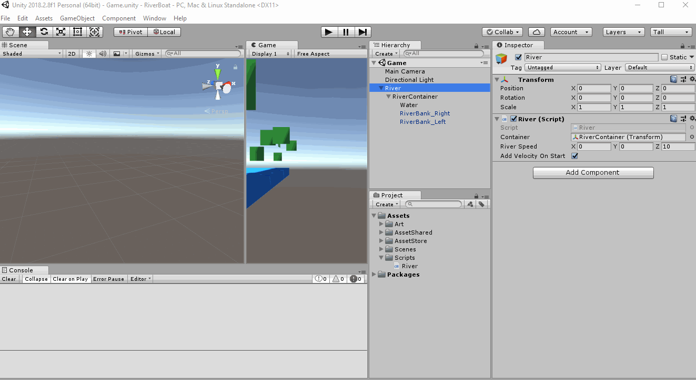
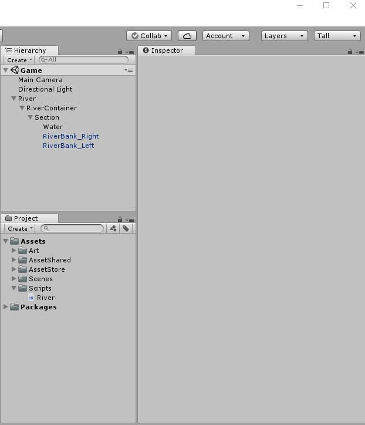
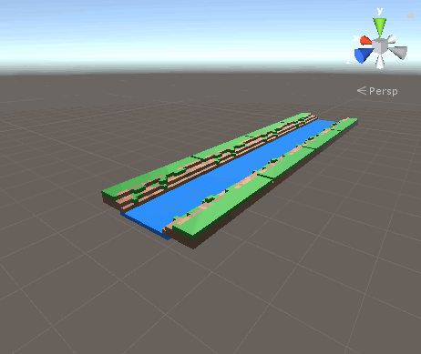

# Making our river longer!

Create a new Empty GameObject
 - Name it Section
 - Make it a child of RiverContainer
 - Reset Transform
 - Make Water and River Bank GameObjects children of Section

**Let's Run our Game**  
Any familiar errors?

You should be getting an error message that says that section doesn't have a rigidbody.

Let's fix this by adding a rigidbody to the Section GameObject and let's also remove the rigibody components from Water and RiverBanks.
**Why are we doing this?**  
We want to treat our section as one physics object.  
So we only need the parent GameObject, Section, to have a Rigidbody 
 - Remember to set UseGravity to false on the Inspector for Section

**Let's Run our Game**  
It should be working like before.  
Now, it is much easier to make our river longer.

On the Section GameObject
 - Right Click > Duplicate

A new GameObject named "Section (1) should have appeared".
Set the Transform values to:

Duplicate a few more and keep adding negative 31 to the Transform's Z value.    
I added another 3 sections!  
This is how my river looks like:  

What happens if you put one object inside of anoter?  
For example, instead of the offset being -31 on Z - try incrementing it by -20  
It looks really cool! [Click here to see how it looks](resources/img/long-river-crashing.gif)

> **Why does this happen?**  
> The river sections are occupying the same space.  
> When we run our game, unity is applying physics to it.  
> Having two physical objects occupying the same space is physically impossible!  
> So Unity physics calculations is pushing the objects away from each other.  
> Which gives us that cool behaviour! :P
> Alrighty, fix your project and let's go to the next lesson!

[<< Previous Lesson](lesson.5.md) | [Next Lesson >>](lesson.7.md)