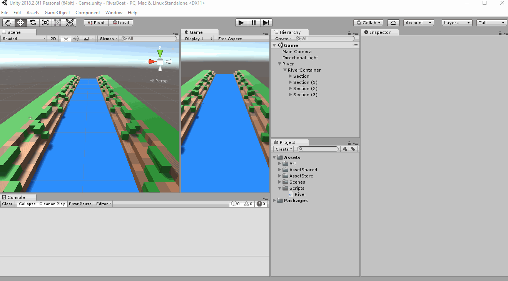
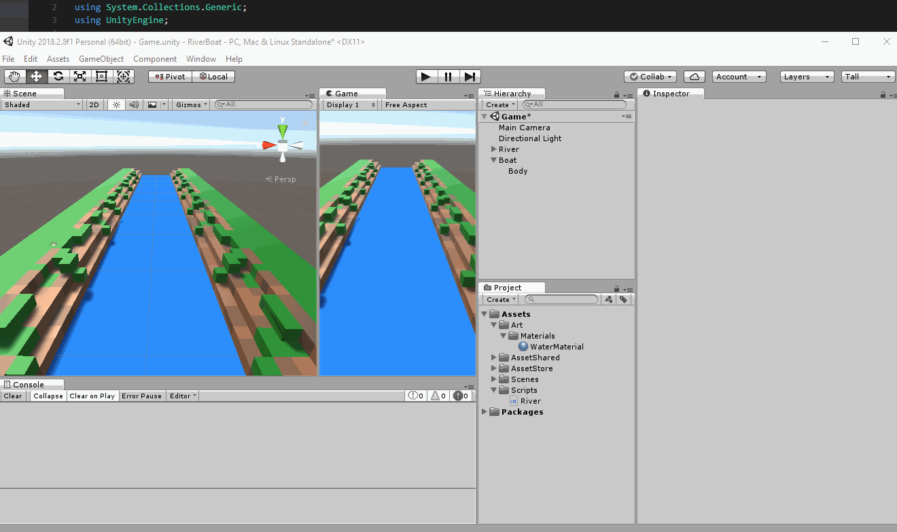
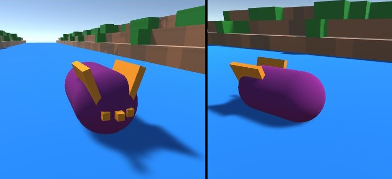
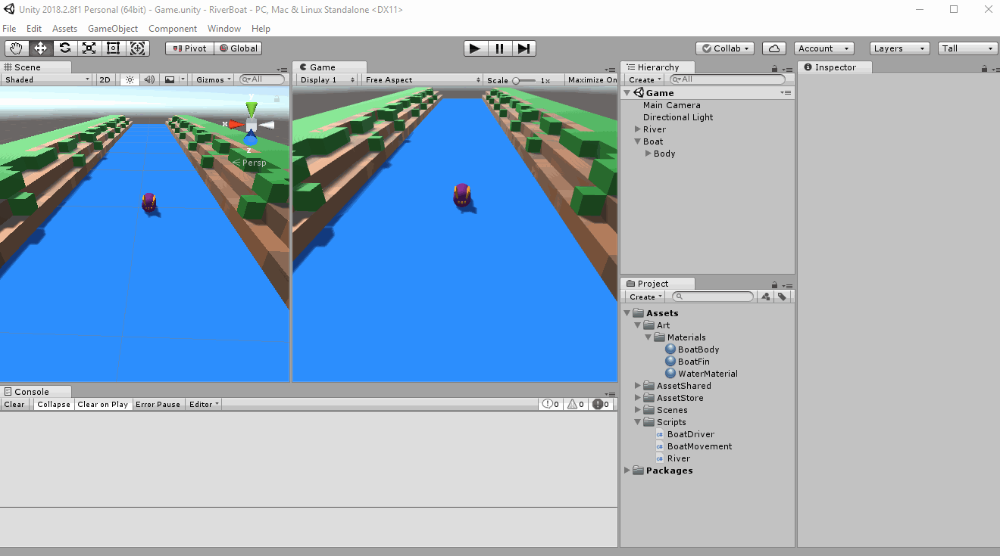
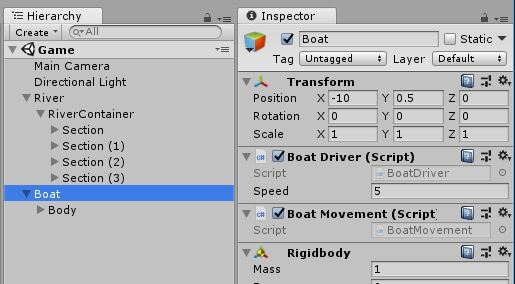
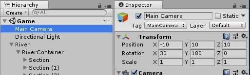

# Adding a Player!

## Making a Boat
Create an Empty GameObject
 - Name it Boat
 - Reset Transform

Add new Capsule under Boat
 - Name it body
 - Remove the Collider

Create Material for our "Capsule Boat" body
 - On the Project Panel
 - Right Click Art/Materials > Create > Material
 - Name it BoatBody

Customize your Boat however you like.
Just make sure that:
> For any new Boat body parts you add are added under  "Boat > Body"
> Remove the Colliders from them.
> You can create more materials for those new body parts

Here is what I did:  

## Making our Boat move  
We need to add 3 components to our boat:  
1. Something to make it move
2. Something to control the movement
3. A rigidbody to apply physics movement

Create a new script called **BoatMovement**  
> In **BoatMovement** script add the variable  
>   - private variable, named "*rb*" of type **Rigidbody**  
> 
> In the method "Start" on the **BoatMovement** script
>   - Get component of type **Rigidbody** and set it to the variable "*rb*"  
> 
> In the **BoatMovement** script add new method called "SetVelocity"
>   - Takes two arguments:
>       - *direction* of type **Vector3**
>       - *speed* of type **float**
>   - The method return **void**
>   - The method is **public**

Code Example : [Link](resources/code-example/BoatMovement_example.1.cs)

Create a new script called **BoatDriver**  
> In **BoatDriver** script add the variables  
>   - public variable, named "*speed*" of type **float** with default value of *5f*
>   - private variable, named "horizontalAxis" of type **float**
>   - private variable, named "*movement*" of type **BoatMovement**   
> 
> In the method "Start" on the **BoatDriver** script
>   - Get component of type **BoatMovement** and set it to the variable "movement"  
>
> In the method "Update" on the **BoatDriver** script
>   - Set horizontalAxis to the value : "*Input.GetAxis("Horizontal")*"
> 
> In the **BoatDriver** script add new method called "FixedUpdate"
>   - Takes no argument
>   - The method return **void**
>   - The method is **private**
>
> In the method "FixedUpdate" on the **BoatDriver** script
>   - call the method "SetVelocity" from the movement variable
>   - The first argument passed is value : *Vector3.left \* horizontalInput*
>   - The second argument passed is the variable *speed*
> 
Code Example : [Link](resources/code-example/BoatDriver_example.1.cs)

Add new components to the Boat GameObject
 - Add the **BoatDriver** script to our *Boat*
 - Add the **BoatMovement** script to our *Boat*
 - Add a **Rigidbody** component to our *Boat*
    - Set UseGravity to false 

Like this:  

Set the boat Transform's position to:  

Set MainCamera Transform to:  

If we play our game, we should be able to move our boat!

**Here are some things to observe:**  
The boat doesn't hit the RiverBanks if we keep going towards it  
More importantly, the river ends!  

How can we automatically create new sections?  
Let's do this next!

---
[<< Previous Lesson](lesson.6.md) | [Next Lesson >>](lesson.8.md)