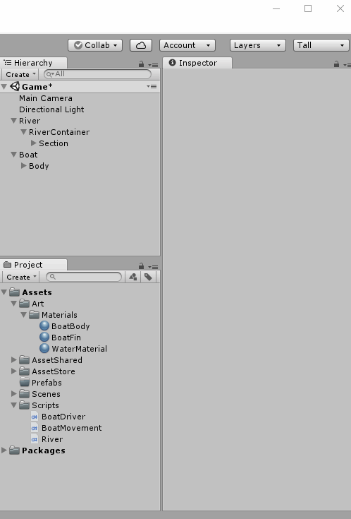
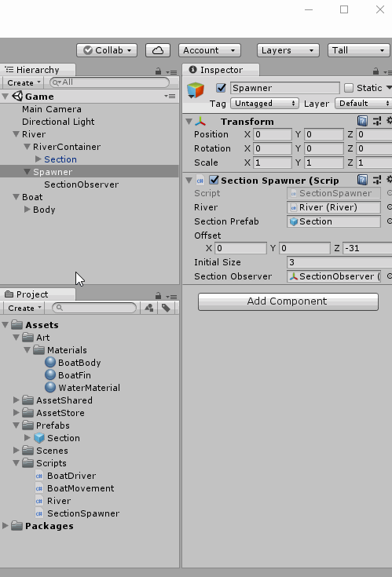

# Making an INFINITY RIVER

## Make River Section as **prefabs**
First delete all the duplicated Sections  

Create a new folder called "Prefab" under Assets
 - On the Project Panel
 - Right Click Assets > Create > Folder
 - Name it Prefabs  
  

Drag the Section GameObject to the Project Panel to make a prefab  
*(move it to the Prefabs folder to keep it organized)*    
  
  

## One more thing!
Sometimes, the rivers sections might collide into one another and that might cause the sections to move in unexpected way.  
Let's tell Unity to not calculate object collisions for our rivers.  
To do that we need to create a new Layer (we will calle it "River") and then we will tell Unity to not care about if a "River" is colliding with another "River".

### Creating new Physics Layer
  

### Removing collision calculations between layers
  

### Setting layer on RiverSection
  

## Let's Code! - RiverSpawner script
Create a new script called **SectionSpawner**
> In the **SectionSpawner** script add the variables
> - public variable, named *river* of type **River**
> - public variable, named *sectionPrefab* of type **GameObject**
> In the **SectionSpawner** script add a new method called "**SpawnSection**"
> - Takes one argument, named *position* of type **Vector3**
> - The method returns **GameObject**
> - The method is **private**
> In the method **SpawnSection** on the script **SectionSpawner**
> - Instantiate a new prefab and save the returned value to a new variable called *section* of type **GameObject**
> - call the method *Add* from the variable *river*
> - return the variable *section*  

Code Example : [Link](resources/code-example/SectionSpawner_example.1.cs)  

Let's add a little bit of more code
> In the script **SectionSpawner** add
> - public variable, named *offset* of type **Vector3**
> - public variable, named *initialSize* of type **int**
> - public variable, named *sectionObserver* of type **Transform**
> - private variable, named *lastSection* of type **Transform**
> In the method "Start" in the  script **SectionSpawner**
> - create a variable named *position* of type **Vector3**
> - set the variable *position* to the value of the variable *offset*
> - create a **for loop** that starts at zero and is incremented by one until  *initialSection*
> In the **for loop** created above
> - call *SpawnSection* and pass the variable *position* as an argument
> - store the return value of *SpawnSection* in a new variable called *section* of type **GameObject**
> - store the value "section.transform" in the variable *lastSection*
> - increment "transform.position" with the value from the variable *position*  

Code Example : [Link](resources/code-example/SectionSpawner_example.2.cs)  

Let's add more code
> In the method "Update" on the **SectionSpawner** script
> - Check if there is an object in the sectionObserver position (see code example)
> - if there isn't
>   - store the value "lastSection.position" in a new variable called *position* of type **Vector3**
>   - call *SpawnSection* and pass the value *position + offset* as an argument
>   - store the return value of *SpawnSection* in a new variable called *section* of type **GameObject**
>   - store the value "section.transform" in the variable *lastSection*  

Code Example : [Link](resources/code-example/SectionSpawner_example.3.cs)  

## Let's go back to Unity and hook up our script to **GameObject**s

Creat new Empty GameObject and make it a child of River
 - Call it Spawner
 - Reset the Transform

  

Create a new Sphere 3D object
 - Make it a child of Spawner
 - Call it SectionObserver
 - Remove the Collider (Sphere Collider)

Position the SectionObserver object somewhere in the river
 - Make sure that it is touching the river

  

Add our *SectionSpawner* script to our *Spawner* **GameObject**

Let's assign the values in our script in the **Inspector Panel**  

Set the values:
 - Offset: 0, 0, -31
 - Initial Size : 3  
  
  

## Let's run our Game!
  

Make sure to save your scripts and scene.  

If we play our game, you can see that new river sections are added to the beginning of our river every time that the sectionObserver is not touching a river section.

We don't really care about the river sections after they passed our boat.  
In fact, if we let those sections stay there, with time, it will consume too much memory of our computer and our computer could eventually crash!

Let's fix that!

## Let's Code! Delete River Sections that have past the Boat
In the River script add new variable
> Add new variables
> - public variable, named *endOfRiverObserver* of type **Transform**
> - public variable, name *riverObjects* of type **List<Transform>**
> Add new method called "RemoveAtEndOfRiver"
> - Takes no arguments
> - Returns **void**
> - The method is **private**
> In the method "RemoveAtEndOfRiver" in the script **River**
> - create variable, named *count* of type **int**
> - assign a value of "riverObjects.Count" to the *count* variable
> - create a **for loop** that goes from count to zero (decrementing by one)
> - in the **for loop**
>   - check if the "z" position of "riverObjects[i]" is greather than "z" position of "endOfRiverObserver"
>   - if that is true
>       - assign the value riverObjects[i] to a new variable called *obj* of type **Transform**
>       - call removeAt with the value "i" on the variable *riverObjects*
>       - call the method Destroy and pass the variable "obj" as an argument

Code Example : [Link](resources/code-example/River_example.7.cs)

Let's add a litte bit more code
In the River script
> Add a method called "Update"
> - Takes no arguments
> - Return **void**
> - The method is **private**
> In the method "Update" add the following instruction
> - a call to the method "RemoveAtEndOfRiver"
> In the method "Add" add the following instructions at the end of the method
> - if riverObjects variable is null
>   - initialize riverObjects to a new object of type **List<Transform>**
> - After the *if block*, call the method "Add" in the variable *riverObjects* and pass the value "obj.transform" as an argument  

Code Example : [Link](resources/code-example/River_example.8.cs)

Let's go back to Unity and hook up new **GameObject**s to the new code we added

Create a new 3D Sphere object
- call it "EndOfRiver"
- Remove the collider (Sphere collider)
- make it a child of River  
  

Position the GameObject EndOfRiver somewhere where we want to delete anything that gets passed it.  
Like here:  

Here is the Transform values I picked:  

Assign the *EndOfRiver* **GameObject** to our **River** script in the Inspector 

## We are done creating our INFINITY RIVER!  
  

[<< Previous Lesson](lesson.7.md) | [Next Lesson >>](lesson.9.md)