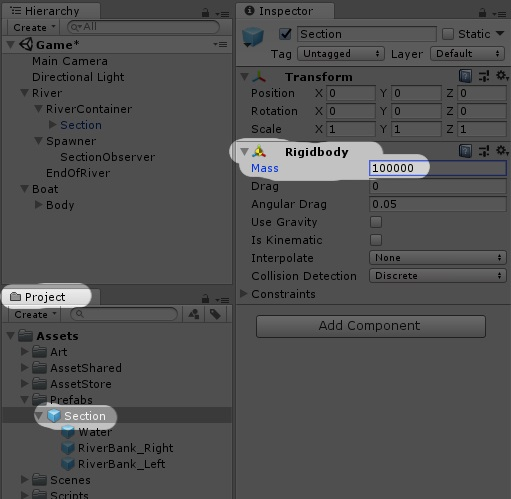

# Making the boat hit the River Banks
If you noticed, when we move our boat, we go right pass the river bank. 

That is because our River Banks and Boat do not have a collider.

So let's add them!

## Add Box Colliders
To River Banks:  

To Boat:  

If you look closely, in the Scene Panel  
You can see some thin green lines around of our objects.  
That is the BoxCollider - the area where collision with other colliders will happen

The River Banks

The Boat

## Play the game and try hitting the sides

Woooooaaah!  
That is Awesome!!!  
[See Awesome Stuff Happening](resources/img/awesome-stuff-happening-01.gif)

> **What is happening?!**  
> This happen because of the mass of our GameObjects.  
> The mass of our river and the Boat is the same.  
> So when the Boat tries to push the river, it is able to to.

Let's increase the mass of our river sections and see if our boat can still push the river around
 - Increaset Section's rigidbody mass to: 100000  
  

If you play the game again, you see that we can't push the river anymore.
but now our Boat is getting pushed backwards!  
**aaah what can we do?  **
We could apply some physics materials to our river, but we will do something simpler.  

Let's freeze the positions and rotations the physics can act on our boat!  

Let's also freeze some position and rotations for our river section prefab  

[<< Previous Lesson](lesson.8.md) | [Next Lesson >>](lesson.10.md)